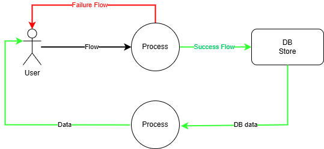
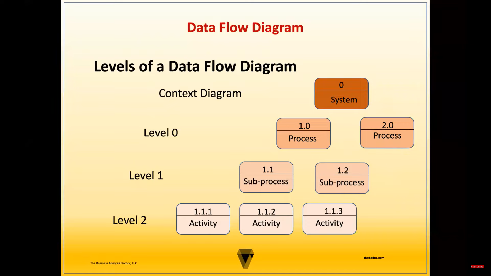

# DFD

Index

## Index

- Introduction
- Symbols
- DFD Types
- Documentation

---

Introduction

## Introduction

- **DFD** stands for **Dataflow Diagram**
- A Data Flow Diagram (DFD) is a visual representation that shows how data moves.
- It helps you understand where data comes from, how it is used, and where it is stored.

---

Symbols

## Symbols

1. user -> Sends or receives data from outside.
2. Flow
3. Process
4. Store

### Colors

- Success -> Green
- Failed -> Red

---

DFD Types

## DFD Types

1. Level 0 -> HLD
2. Level 1 -> LLD -> Breaks Level 0 into sub-processes for more detail.

---

Documetation

## Documentation

- draw.io DFD Tool : [https://app.diagrams.net/]

